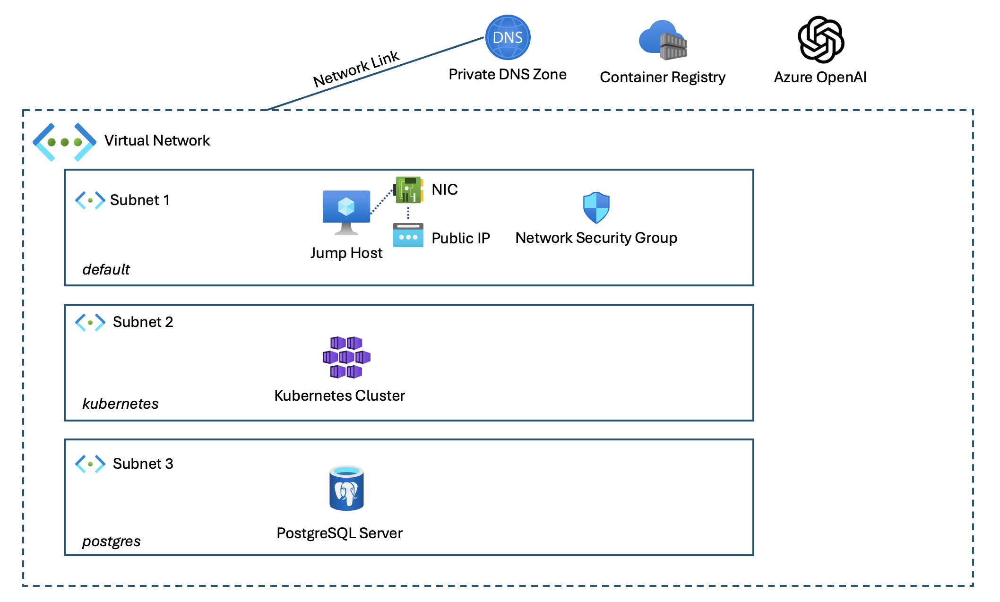

# Chapter 7 - Lab: Developing and Deploying a Complex Landscape

## Goal
The goal of this exercise is to deploy a more complex set of Azure resources that are typical for modern cloud and AI solutions.

You will deploy... 
- A resource group to contain all Azure resources created in this lab
- A virtual network with three subnets to interconnect the various Azure services 
- A Linux virtual machine that can server as jump host
- An Azure Container Registry to store a demo application container image
- An Azure Kubernetes Services cluster to run containerized applications.
- An Azure Database for PostgreSQL Flexible Server as an example for a relational database service.
- A Private DNS Zone that can resolve Azure Database for PostgreSQL domain names which are not published in the public DNS.
- An Azure OpenAI service that offers GPT-3.5 as a service.

### Writing Terraform code
Note that the objective of this lab is _not_ to create a perfectly modular structure for your Terraform code. This will be considered in a future chapter. For now, we recommend you stick to a very simple structure like this:

- `providers.tf`: The definition of Terraform providers you must use. This file is already included in your repo and can be used as is!
- `variables.tf`: The definition of all variables you use in your Terraform code. While you can complete this lab by hardcoding everything, we want to encourage you to think about which variables you really need. 
- `outputs.tf`: The definition of outputs your Terrfaform code produces. Like variables, using outputs is optional but highly encouraged since it avoids you having to switch back and forth between your editor, your terminal, and the Azure portal. 
- `main.tf`: Your actual Terraform code. Just keep adding to this file. 

The Visual Studio Code editor installed on your DevBox provides tne best authoring experience for Terraform!

## 0 - Setting up your computer for this lab.
First, you will need to set up your computer so can use Terraform and Visual Studio Code. This should already be covered in [Chapter-6](../chapter-6/README.md).

## 1 - Resource Group
In this step, you will create a resource group. Resource groups allow you to organize your Azure resources. You will also create tags, i.e., metadata that you can use for billing, to specify who owns the resources in your organization, etc.

[Detailed instructions](./ch-01.md)

## 2 - Networking
In this step, you wull create all networking resorces that are required to provide a private network to your Azure resources and expose some of them publicly.

[Detailed instructions](./ch-02.md)

## 3 - Jump Host VM
Now it's time to provision a virtual machine that can act as jump host. 

[Detailed instructions](./ch-03.md)

## 4 - Container Registry
You will soon create a Kubernete cluster, but a prerequisite for any container platform is a store for your container images - a registry. 

[Detailed instructions](./ch-04.md)

## 5 - Kubernetes
Instead of running application on virtual machines, higher level services such as Kubernetes or Azure App Services are often the preferred solution to run your applications in Azure. 

[Detailed instructions](./ch-05.md)

## 6 - PostgreSQL
Next, you will deploy a managed PostgreSQL server. Unlike the jumphost VM and the ACR, which you have exposed publicly, you will restrict network access to this server to the virtual network.

[Detailed instructions](./ch-06.md)

## 7 - Azure OpenAI
The final resource you will deploy is an Azure OpenAI service. This allows you to build ChaptGPT like experiences.

[Detailed instructions](./ch-07.md)

## Continue

**[< back](../chapter-6/README.md) | [home](../../README.md) | [next >](../chapter-8/README.md) | [solutions](../../solutions/chapter-7/README.md)**
