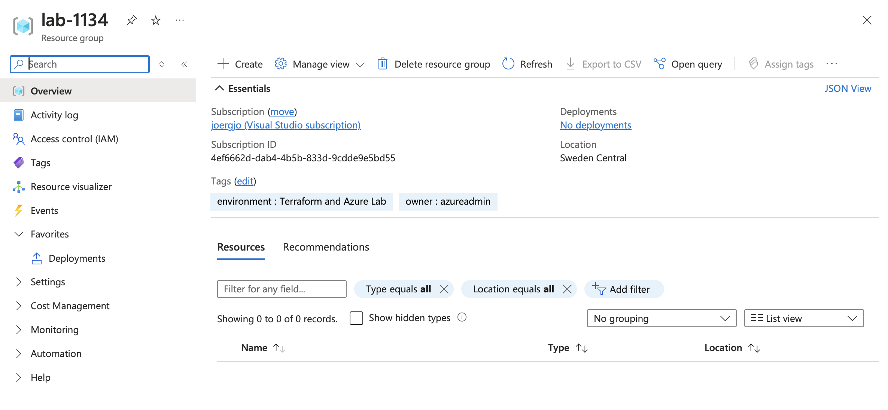

# 1 - Resource Group
In this step, you will create a resource group. Resource groups allow you to organize your Azure resources. You will also create tags, i.e., metadata that you can use for billing, to specify who owns the resources in your organization, etc.

## Objectives
- Create a resource group. All resources you create in subsequent steps will be placed in this resource group and will typically be located in the same Azure region as the resource group. 
- Use `swedencentral` as Azure region.
- Add tow tags to resource groups:
    - The tag `owner` with a value of your CD username.
    - The tag `environment` with the value `Terraform and Azure Lab`.
- Randomize parts of the resource groups name. You can use the `random` resource provider that is already included as a provider to create random strings, names, or numbers.

## Success criteria
- You have deployed a resource group in Sweden Central.
- The resource group has two tags `owner` and `environment`.

### Verification
Look up your resource group's details in the Azure portal.

## Learning resources
- [azurerm_resource_group](https://registry.terraform.io/providers/hashicorp/azurerm/latest/docs/resources/resource_group)
- [Quickstart: Create an Azure resource group using Terraform](https://learn.microsoft.com/en-us/azure/developer/terraform/create-resource-group?tabs=azure-cli)

## Sample solution
See [here](../../solutions/chapter-7/ch-01/).

[Back](./README.md)