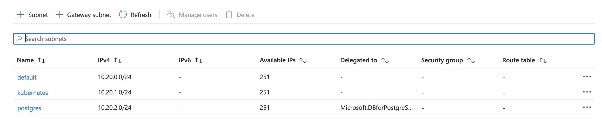

# 2 - Networking
In this step, you wull create all networking resorces that are required to provide a private network to your Azure resources and expose some of them publicly.

## 2a - Virtual Network
First, you will create a virtual network. Most Azure services can be "plugged" into a virtual network to keep the communication between services private.

### Objectives
- Create a virtual network in the resource group and region you have created previously.
- Randomize the virtual network's name the same way you have randomized your resource group's name, i.e., reuse the same random id or string so the names are consistent.
- Set the address space (CIDR range) of the virtual network to `10.20.0.0/16`.

### Success criteria
- You have deployed a virtual network with an address space of `10.20.0.0/16`.

#### Verification
Look up your virtual network's details in the Azure portal.

## 2b - Subnets
In the previous step, we said the mosz Azure services plug into a virtual network. To be precise, they plug into a subnet in your virtual network. Subnets allow you to carve up your address space for specific types of services and also enforce different rules what traffic is permitted to flow into, out of, or within a subnet.

In this lab, we require three subnets.

### Objectives
- Create three subnets in the virtual network you have created previously.
- Use the following names and CIDR ranges for your subnets:
    - `default`: `10.20.0.0/24`
    - `kubernetes`: `10.20.1.0/24`
    - `postgres`: `10.20.2.0/24`
- Delegate the `postgres` subnet to the service `Microsoft.DBforPostgreSQL/flexibleServers` with the action `Microsoft.Network/virtualNetworks/subnets/join/action`.

> Subnet delegation allows a managed service to take control over the subnet. The managed database you create later requires this.

#### Verification
Look up your subnet details in the Azure portal.

> We don't use up all the space we have available in our virtual network. This is by design.

### Success criteria
- You have created three subnets in your virtual network with the required names and CIDR ranges.
- The `postgres` is delegated to the service `Microsoft.DBforPostgreSQL/flexibleServers` with the action `Microsoft.Network/virtualNetworks/subnets/join/action`.

## 2c - Public IP
You will soon deploy a virtual machine that you can use as a jump host. This host will be exposed to the Internet and hence requires a public IP address.

### Objectives
- Create a public IP address.
- Use the `Standard` SKU.
- Allow Azure to allocate the IP address statically.
- Place the IP address in your existing resource group in Sweden Central.
- Randomize the public IP's name the same way you have randomized your resource group's name.

### Success criteria
- You have created a public IP address. You can look up its value after the resource has been created. You will keep this address until you delete the resource.

#### Verification
Look up your public IP address resource in the Azure portal.

## 2d - Network Security Group
Network securiy groups (NSG) allow you define firewall rules to restrict what kind of traffic can flow in a subnet. We want to allow access to our to be created jump host via the SSH protocol, i.e., TCP/22.

### Objectives
- Create a network security group.
- Place the NSG in your existing resource group in Sweden Central.
- Randomize the NSG's name the same way you have randomized your resource group's name.
- Associate the NSG with your `default` subnet.
- Create a rule that allows traffic to flow as follows:

Resource attribute         | Value
-------------------------- | ------ 
Name                       | `SSH`
Priority                   | `1001`
Direction                  | `Inbound`
Access                     | `Allow`
Protocol                   | `Tcp`
Source port range          | `*`
Destination port range     | `22`
Source address prefix      | `*`
Destination address prefix | `*`

> In a real world deployment, you would rather use specialized servies like [Azure Bastion](https://learn.microsoft.com/en-us/azure/bastion/bastion-overview) to expose SSH or RDP endpoints.  You can also optimize the rule you have created to only accept traffic from your current network's source IP. 

### Success criteria
- You have created an NSG. 
- Besides Azure's default rules, which are created automatically, the NSG contains in inbound rule that allows SSH traffic to flow freely.

#### Verification
Look up your NSG rules in the Azure portal.

## 2d - Network Interface
You are almost ready to create the jump host VM, but a VM requires a network interface. The network interface's IP configuration allows you to control whether the interface is assigned free IP address from the subnet statically or dynamically, and also bind to the previously created public IP.

### Objectives
- Create a network interface.
- Place the network interface in your existing resource group in Sweden Central.
- Create an IP configuration with dynamic IP allocation.
- Associate the network interface with the `default` subnet.
- Associate the previously created public IP with the network interface.
- Randomize the network interface's the same way you have randomized your resource group's name.

### Success Criteria
- You have created a network interface.
- The network interface is connected to the `default` subnet.
- The network interface uses the public IP address you have created previously.
- The network interface uses a private IP address that is dynamically assigned from the CIDR range `10.2.0.0/24`.

#### Verification
Feel free to look up the network interface resource in the portal, but in the next step it will be attached to a VM
which proves that it works correctly.

## Learning resources
- [azurerm_virtual_network](https://registry.terraform.io/providers/hashicorp/azurerm/latest/docs/resources/virtual_network)
- [azurerm_subnet](https://registry.terraform.io/providers/hashicorp/azurerm/latest/docs/resources/subnet)
- [azurerm_public_ip](https://registry.terraform.io/providers/hashicorp/azurerm/latest/docs/resources/public_ip)
- [azurerm_network_security_group](https://registry.terraform.io/providers/hashicorp/azurerm/latest/docs/resources/network_security_group)
- [azurerm_network_interface](https://registry.terraform.io/providers/hashicorp/azurerm/latest/docs/resources/network_interface)
- [Quickstart: Use Terraform to create a virtual network](https://learn.microsoft.com/en-us/azure/virtual-network/quick-create-terraform?tabs=azure-cli)

## Sample solution
See [here](../../solutions/chapter-7/ch-02/).

[Back](./README.md)