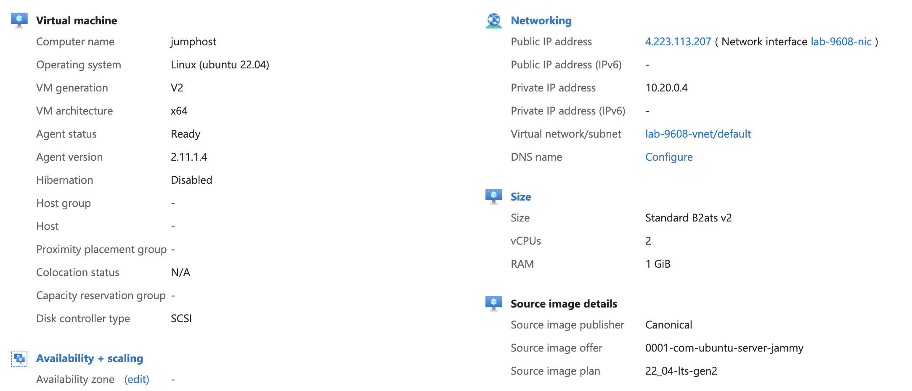

# 3 - Jump Host VM
Now it's time to provision a virtual machine that can act as jump host. 

## Objectives
- Create Linux virtual machine.
- Place the VM in your existing resource group in Sweden Central.
- Assign the previously created network interface to the VM.
- Use `YWRtaW51c2VyC` as admin username.
- Use the SSH key you have created previously.
- Use `jumphost` as hostname.
- Randomize the VM's name the same way you have randomized your resource group's name. Note that VM name and hostnames are different attributes!
- Create an operating system disk with...
- Use `Standard_B2ats_v2` as VM size.
- Use `StandardSSD_LRS` as storage account type for the OS disk.
- Use the following VM image:

Resource attribute         | Value
-------------------------- | ------ 
Publisher                  | `Canonical`
Offer                      | `0001-com-ubuntu-server-jammy`
Sku                        | `22_04-lts-gen2`
Version                    | `latest`

## Success Criteria
- The VM is up and running with the current version of Ubuntu 22.04 LTS Jammy.
- The VM has both a public IP and a private IP address.

### Verification
Look up the properties of your jump host VM in the Azure portal. `Computer name` should say `jumphost`, it should have a private IP address from your `default` subnet and the public IP address you have created.  

> You can also log on to the VM using SSH as `YWRtaW51c2VyC` and your SSH key. 

## Learning resources
- [azurerm_linux_virtual_machine](https://registry.terraform.io/providers/hashicorp/azurerm/latest/docs/resources/linux_virtual_machine)
- [Quickstart: Use Terraform to create a Linux VM](https://learn.microsoft.com/en-us/azure/virtual-machines/linux/quick-create-terraform?tabs=azure-cli)

## Sample solution
See [here](../../solutions/chapter-7/ch-03/).

[Back](./README.md)
