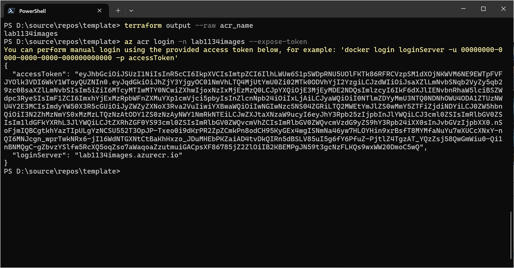

# 4 - Container Registry
You will soon create a Kubernete cluster, but a prerequisite for any container platform is a store for your container images - a registry. 

## Objectives
- Create an Azure Container Registry (ACR).
- Place the ACR in your existing resource group in Sweden Central.
- Randomize the registry's name the same way you have randomized your resource group's name.
- Use the `Basic` SKU.
- Disable admin access.

> The purpose of "disable admin access" is to disable traditional username/password based authentication. You will use Entra ID based access instead.

## Success Criteria
- The ACR is up and running.
- You can upload the test application's source code to the ACR and have it build a container image. 

### Verification
On your PowerShell terminal run the following command. Please use Azure Cloudshell if you are not able to connect ti ACR via Powershell.

```powershell
# Replace youracr with your registry's name 
az acr login -n "youracr" --expose-token
az acr build -r "youracr" -t go-probe:latest --platform linux/amd64 https://github.com/joergjo/go-probe.git
```

This step will pull down the source code of our test application into your registry and build a container image. The application will be used later throughout this lab for additional verification steps. 




You can also check in the Azure portal whether your registry now contains a repository called `go-probe` that contains an image.


## Learning resources
- [azurerm_container_registry](https://registry.terraform.io/providers/hashicorp/azurerm/latest/docs/resources/container_registry)
- [Quickstart: Use Terraform to create a Linux VM](https://learn.microsoft.com/en-us/azure/virtual-machines/linux/quick-create-terraform?tabs=azure-cli)
- [Quickstart: Build and run a container image using Azure Container Registry Tasks](https://learn.microsoft.com/en-us/azure/container-registry/container-registry-quickstart-task-cli)


## Sample solution
See [here](../../solutions/chapter-7/ch-04/).

[Back](./README.md)