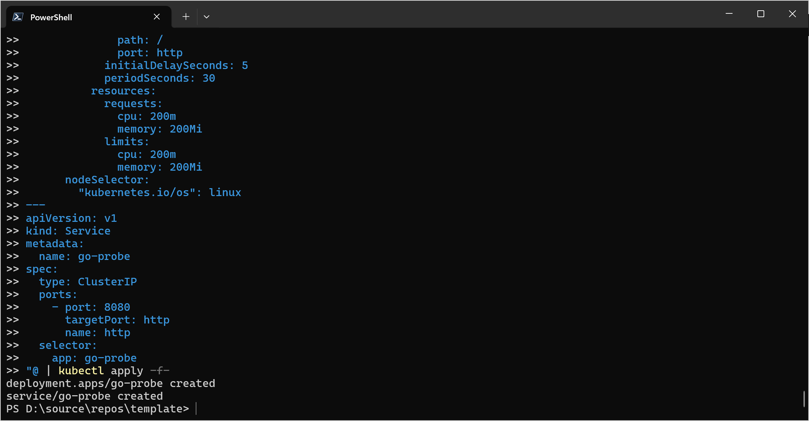

# 5 - Kubernetes
Instead of running application on virtual machines, higher level services such as Kubernetes or Azure App Services are often the preferred solution to run your applications in Azure. 

## 5a - Azure Kubernetes Service
Create an Azure Kuberetes Service (AKS) cluster so you can run containerized applications.

### Objectives
- Create an AKS cluster.
- Place the cluster in your existing resource group in Sweden Central.
- Use Kubernetes version `1.29.5`.
- Use a system-assigned identity for the cluster.
- Randomize the cluster's name and DNS name the same way you have randomized your resource group's name.
- For the default node pool use the following settings:
    - Set `agentpool1` as name.
    - Size the pool to contain three VMs.
    - Use `Standard_D2ads_v5` as VM size.
    - Place the three VMs in different availability zones.
    - Disable the cluster autoscaler
    - Use `Ephemeral` OS disks.
    - Set the OS disk size to 70 GB.
    - Attach the node pool to the `kubernetes` subnet you have created previously.
- For the network profile use the following settings:
    - Network plugin: `azure`
    - Network plugin mode: `overlay`
    - Network policy: `azure`
    - Pod CIDR: `192.168.0.0/16`
    - Load Balancer SKU: `standard` 
- For the Linux profile, use `YWRtaW51c2VyC` as admin username and the SSH key you have created previously.


### Success Criteria
- You have created an AKS cluster.

## 5b - Passwordless Access to ACR
The container registry you have created previously is not a public registry that allows anonymous access. While we could provide a username and password provided by the ACR to Kubernetes so it can pull images, we'd rather want _passwordless_ access, i.e., we'd like to authorize the AKS cluster resource's identity to be able to access the ACR through access tokens issued by Entra ID.

### Objectives
- Create a Role Assignment that grants the role `ACRPull` to the AKS resource's `kubelet` identity on your ACR.
- Assign the role at smallest scope possible.

> Tip: In your Terraform code, add this attribue to the role assignment resource: `skip_service_principal_aad_check = true`

### Success Criteria
- The `kubelet` identity can pull images from the ACR.
- You can deploy the test application using the image stored in your ACR.

### Verification
On your PowerShell terminal run the following command:


```powershell
# We need to set a bunch of environment variables so the 
# following commands pick up the correct values

# Replace "youraks" with your cluster's name,
# "yourrg" with your resource group's name, and
# "youracr" with your ACR's name
$env:CLUSTER = "youraks"
$env:RG = "yourrg"
$env:ACR = "youracr" 
$env:CSRF_KEY = openssl rand -hex 24

# Download certificate to access your cluster
az aks get-credentials -n $env:CLUSTER -g $env:RG

# Deploy the test application - we pipe the "deplyoment manifest" 
# Kubernetes needs to do so as string into the kubectl command
@"
apiVersion: apps/v1
kind: Deployment
metadata:
  name: go-probe
spec:
  replicas: 1
  selector:
    matchLabels:
      app: go-probe
  template:
    metadata:
      labels:
        app: go-probe
    spec:
      containers:
        - name: go-probe
          image: ${env:ACR}.azurecr.io/go-probe:latest
          ports:
            - containerPort: 8080
              name: http
          env:
            - name: GO_PROBE_CSRF_KEY
              value: ${env:CSRF_KEY}
            - name: GO_PROBE_DEVELOPER_MODE
              value: "true"
          livenessProbe:
            httpGet:
              path: /
              port: http
            initialDelaySeconds: 5
            periodSeconds: 30
          readinessProbe:
            httpGet:
              path: /
              port: http
            initialDelaySeconds: 5
            periodSeconds: 30
          resources:
            requests:
              cpu: 200m
              memory: 200Mi
            limits:
              cpu: 200m
              memory: 200Mi
      nodeSelector:
        "kubernetes.io/os": linux
---
apiVersion: v1
kind: Service
metadata:
  name: go-probe
spec:
  type: ClusterIP
  ports:
    - port: 8080
      targetPort: http
      name: http
  selector:
    app: go-probe
"@ | kubectl apply -f-

# Create a tunnel to our service in Kubernetes
kubectl port-forward svc/go-probe 8080:8080
```

The last command creates a secure tunnel from your local computer to the AKs cluster. Open http://localhost:8080 and you will be able to access the test application without exposing it to the internet! 

Keep `kubectl port-forward` running, you will continue to use the test application in later steps.





## Learning resources
- [azurerm_kubernetes_cluster](https://registry.terraform.io/providers/hashicorp/azurerm/latest/docs/resources/kubernetes_cluster)
- [Quickstart: Deploy an Azure Kubernetes Service (AKS) cluster using Terraform](https://learn.microsoft.com/en-us/azure/aks/learn/quick-kubernetes-deploy-terraform?pivots=development-environment-azure-cli)


## Sample solution
See [here](../../solutions/chapter-7/ch-05/).

[Back](./README.md)
