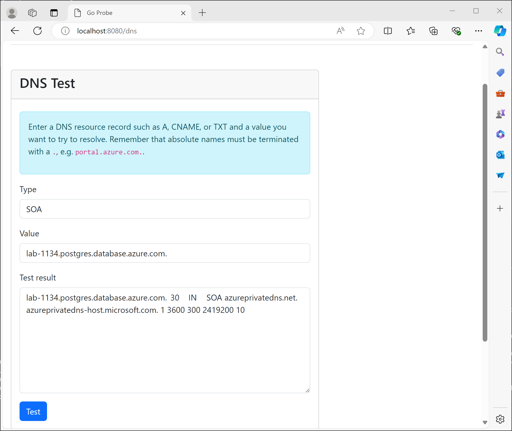
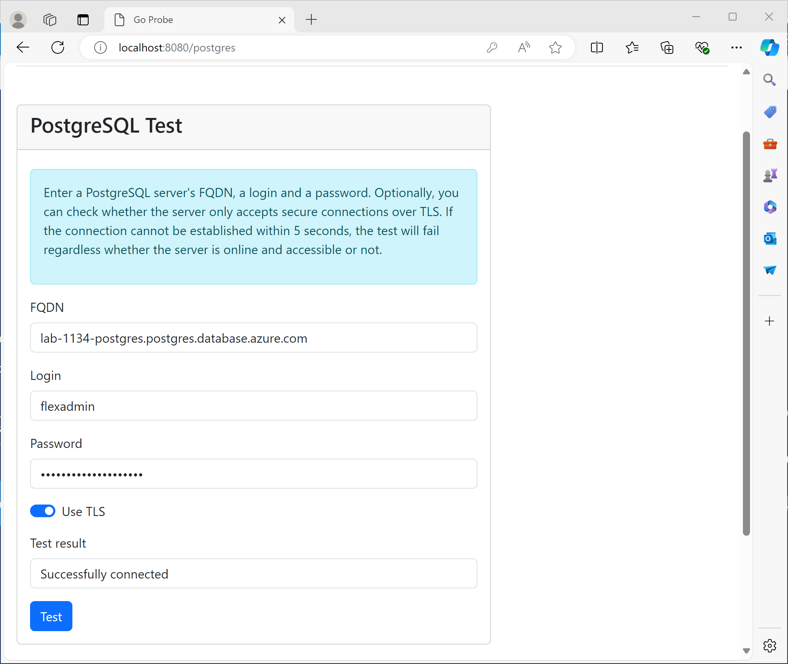

# 6 - PostgreSQL
Next, you will deploy a managed PostgreSQL server. Unlike the jumphost VM and the ACR, which you have exposed publicly, you will restrict network access to this server to the virtual network.

## 6a - Private DNS Zone
Before you can deploy the database server, you must deploy a Private DNS Zone to allow applications to resolve the PostgreSQL FQDN to its private IP address.

### Objectives
- Create a private DNS zone.
- Place the DNS zone in your existing resource group. Unlike the other resources you have created so far, a DNS zone is a global resource and hence not placed in a specific region.
- Use the following name for the DNS zone: `randomname.postgres.database.azure.com`, where randomname is an arbitrary string of lower-case letters and the random ID you have been using for the other resources, e.g. `lab3456.postgres.database.azure.com`. 

### Succees Criteria
- You have created a private DNS zone with desired name.

## 6b - Network Link
So far, the DNS zone just exists, but if you tried to use it through tools such as `nslookup` or `dig`, you will not find any resource records for this zone. To use the DNS zone with your virtual network, you have to create a network link that associates the DNS zone with the virtual network.

### Objectives
- Create a private DNS zone network link.
- Place the network link in your existing resource group in Sweden Central. 
- The link must refer to your previously created private DNS zone. 
- The linked network must be your virtual network you have created before.
- Randomize the network link's name the same way you have randomized your resource group's name.

### Success Criteria
- You have linked the private DNS zone to your virtual network.
- You can use the test application to query the DNS zone.

#### Verification
On your test app's home page, click the [`DNS`](http://localhost:8080/dns) link.

Enter the following values and click `Test`:

- Type: `SOA`
- Value: Fully qualified domain name of your PostgreSQL private DNS zone, e.g. `lab-1134.postgres.database.azure.com.` (note the trailing `.`!)

The app should resolve the start of authority resource record.

## 6c - Azure Database for PostgreSQL Flexible Server
With DNS working properly, you can now create an Azure Database for PostgreSQL Flexible Server.

### Objectives
- Create an Azure Database for PostgreSQL Flexible Server.
- Place the server in your existing resource group in Sweden Central. 
- Use PostgreSQL version 15.
- Use `B_Standard_B1ms` as SKU.
- Deploy it to availability zone 1.
- Set its storage size to 32768 MB.
- Enable storage auto grow.
- Set backup retention to 7 days.
- Disable public network access.
- Use `flexadmin` as PostgreSQL administrator login name.
- Use a random secure password for the PostgreSQL administrator login. 
- Inject the server in the `postgres` subnet.
- Associate it with your private DNS zone.

> Note that we don't create our own database. We could have easily done so using Terraform, but the test application simply checks whether it can connect to the built-in `postgres` database. 

### Success Criteria
- You have created an Azure Database for PostgreSQL Flexible Server.
- You can connect to the server from the test application.

#### Verification
On your test app's home page, click the [`PostgreSQL`](http://localhost:8080/postgres) link.

Enter the following values and click `Test`:

- FQDN: Fully qualified domain name of your Azure Database for PostgreSQL Flexible server 
- Login: `flexadmin`
- Password: The password you have set for your server. (You can use [`terraform output`](https://developer.hashicorp.com/terraform/cli/commands/output) to retrieve it.)
- Use TLS: Enabled

The app should successfully connect to your server.

> Note that TLS is enforced by Azure Database for PostgreSQL Flexible Server unless you disable it at the server level!

## Learning resources
- [azurerm_postgresql_flexible_server](https://registry.terraform.io/providers/hashicorp/azurerm/latest/docs/resources/postgresql_flexible_server)
- [Deploy a PostgreSQL Flexible Server Database using Terraform](https://learn.microsoft.com/en-us/azure/developer/terraform/deploy-postgresql-flexible-server-database?tabs=azure-cli)

## Sample solution
See [here](../../solutions/chapter-7/ch-06/).

[Back](./README.md)
