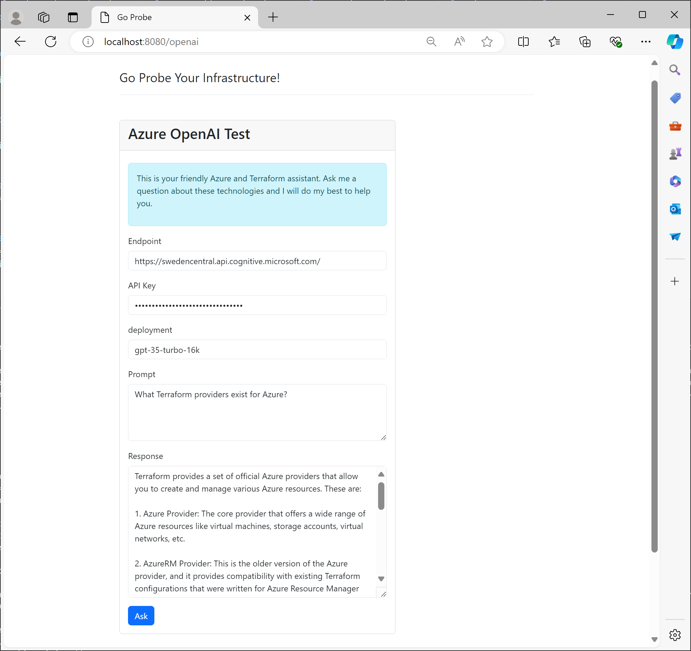

# 7 - Azure OpenAI
The final resource you will deploy is an Azure OpenAI service. This allows you to build ChaptGPT like experiences.

## Objectives
- Create an Cognitive Account of type `OpenAI`.
- Place the account in your existing resource group in Sweden Central. 
- Select `S0` as SKU.
- Randomize the account name the same way you have randomized your resource group's name.
- Create a Cognitive Deployment using
    - `OpenAI`as model format
    - `gpt-35-turbo-16k` as model name and resource name
    - `0613` as model version
    - `Standard` as scale type
    - a capacity of 20

> Capacity of 20 means 20,000 tokens per minute can be processed, or roughly 15,000 words if you are using English as language.

## Success Criteria
- You have created an Azure OpenAI endpoint that supports the `gpt-35-turbo-16k` model and can process up to 120,000 tokens per minute.
- You can use the test application to ask OpenAI questions about Azure and Terraform.

### Verification
- On the test application`s home page, click the OpenAI link.
- Enter your OpenAI 
    - service's endpoint (check the Azure portal)
    - your API key (check the Azure portal)
    - the deployment name (this what in Terraform is called the model name, i.e. `gpt-35-turbo-16k`)
    - a prompt, i.e., a question you'd like to ask about Azure or Terraform
- Click the "Ask" button

The test app should return a useful response from our GPT 3.5 model, similar to ChatGPT.

## Learning resources
- [azurerm_cognitive_deployment](https://registry.terraform.io/providers/hashicorp/azurerm/latest/docs/resources/cognitive_deployment)
- [azurerm_cognitive_account](https://registry.terraform.io/providers/hashicorp/azurerm/latest/docs/resources/cognitive_account)
- [Deploy and run a Azure OpenAI/ChatGPT app on AKS with Terraform](https://techcommunity.microsoft.com/t5/fasttrack-for-azure/deploy-and-run-a-azure-openai-chatgpt-app-on-aks-with-terraform/ba-p/3839611)

## Sample solution
See [here](../../solutions/chapter-7/complete/).

[Back](./README.md)