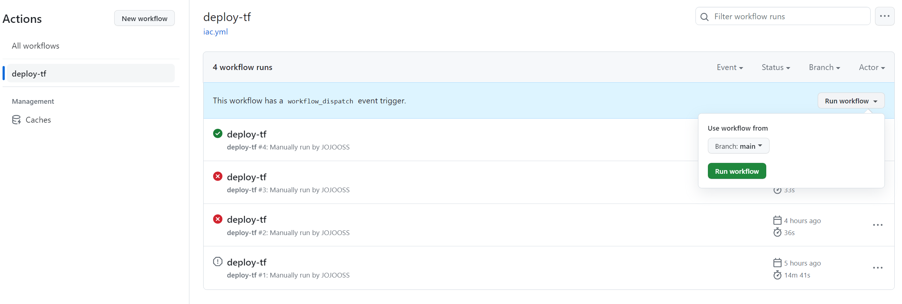
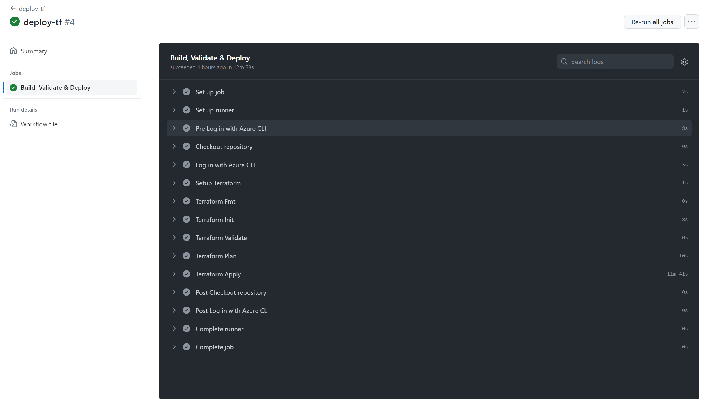

# 7 - GitHub Actions Workflow
Congratulations! If you have made it this far, you can successfully deploy a number of Azure services, some simple, some rather complex... from your machine. You need a pipeline like an GitHub Actions workflow to automate this, and you need to move the state that Terraform maintains from your DevBox to cloud storage. 

## Preparation
Terraform's state mechanism poses an interesting challenge &mdash; if you need some sort of cloud infrastructure like Azure Blob Storage to support Terraform, how can this be created? 

### Create an Azure Storage Account and a Container
While there are number of solutions to this chicken and egg problem, we use the simplest and most pragmatic - we rely on native Azure tools like the Azure CLI to create this special "bootstrapping" resource.

Replace `yourname` with your CD account name.

```powershell
$RAND = Get-Random
$USERNAME = "yourname"
$RESOURCE_GROUP_NAME = "$USERNAME-tf"
$STORAGE_ACCOUNT_NAME = "tfstate$RAND"
$CONTAINER_NAME = "tfstate"

# Create resource group
az group create --name $RESOURCE_GROUP_NAME --location swedencentral

# Create storage account
az storage account create --name $STORAGE_ACCOUNT_NAME `
  --resource-group $RESOURCE_GROUP_NAME `
  --sku Standard_LRS `
  --encryption-services blob `
  --min-tls-version TLS1_2

# Create blob container
az storage container create --name $CONTAINER_NAME --account-name $STORAGE_ACCOUNT_NAME

# Get the primary access key
az storage account keys list --account-name $STORAGE_ACCOUNT_NAME `
  --resource-group $RESOURCE_GROUP_NAME `
  --query '[0].value' `
  --output tsv
```
Copy the value returned by the last command to a note or text file for later use or rerun the command if you need to get the key again. This key is used by Terraform to access your storage account.

> Some of the commands used above may emit warnings about running a 32-bit version of Python on a 64-bit CPU. You can ignore these.

### Update Terraform Provider Configuration
Now you must configure Terraform to use your new state store instead of writing its state in your local working directory, as it did in all the previous steps.

Edit your `providers.tf` file as follows: 

```terraform
terraform {
  required_providers {
    azurerm = {
      source  = "hashicorp/azurerm"
      version = "~> 3.110.0"
    }
    random = {
      source  = "hashicorp/random"
      version = "~>3.0"
    }
  }
  backend "azurerm" {
    resource_group_name  = ""
    storage_account_name = ""
    container_name       = "tfstate"
    key                  = "terraform.tfstate"
  }
  required_version = ">= 1.1.0"
}

provider "azurerm" {
  features {}
}
```

> Tip: You may have noticed that `resource_group_name` and `storage_account_name` are empty. This is on purpose. While you could hardcode the names here, rather try to set these values dynamically in your workflow and read the relevant values from environment variables. 

> Tip: Once you start authoring a workflow in Visual Studio Code, you will be offered to install the "GitHub Actions for VS Code" extension. Install this extension to vastly improve your editing experience!  

## Objectives
- Destroy the resources you have set up in steps 1 to 7.
- Review your Terraform code for any changes that might be required in order to run remotely. 
- Create a GitHub Actions workflow that deploys the resources and uses your Blob storage.
- In your workflow, use the runner [`os-small-amd64-linux`].
- Create a workflow actions repository secret named `ARM_ACCESS_KEY` and set it to the value of the primary access key you have obtained previously.
- Commit the workflow to your GitHub repository.
- Trigger the workflow manually. 

> Note that you do not need to recreate the validation steps you have performed manually like building the container image or deploying the test application to Kubernetes in your workflow. Focus on deploying your infrastructure with Terraform.

## Success Criteria
- You have created a GitHub Actions workflow.
- You can run the workflow manually and repeatedly. Triggering the workflow when there no changes to your Terraform code doesn't modify your resources, updates will be applied accordingly.   

> Tip: Try appliyng both subtle and crass changes to a resource, e.g. add a tag `role: jump host` to your jump host VM and apply that change, and then change the VM size to `Standard_B2als_v2` and see what happens.


### Verification
Check whether your resources have been (re)created in the Azure portal. Check the `Actions` pane of your GitHub repo to see the execution history of your workflow dispatches. 





## Learning resources
- [azurerm](https://developer.hashicorp.com/terraform/language/settings/backends/azurerm)
- [Store Terraform state in Azure Storage](https://learn.microsoft.com/en-us/azure/developer/terraform/store-state-in-azure-storage?tabs=azure-cli)
- [Deploy to Azure infrastructure with GitHub Actions](https://learn.microsoft.com/en-us/devops/deliver/iac-github-actions)
- [Deploy Infra with Terraform, Azure pipelines & GitHub Actions](https://www.youtube.com/watch?v=4aDJC9nRS3U&pp=ygUoQXp1cmUgVGVycmFmb3JtIEdpdEh1YiBBY3Rpb25zIE1pY3Jvc29mdA%3D%3D)


## Sample solution
See the updated Terraform code and workflow definition [here](../../solutions/chapter-7/workflow/).

[Back](./README.md)