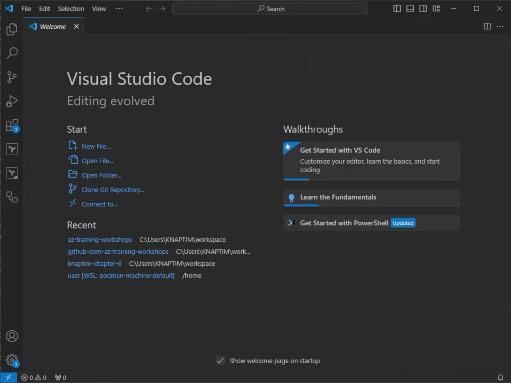

# Setup Instructions

On your laptop, open a PowerShell 7 terminal window. Keep that terminal window open, you will need it.

For the lab parts you will need the following tools installed on your laptop:
- Powershell 7.2.24
- Winget v1.9.25200
- az CLI Version 2.69.0
- VS Code with HashiCorp Terraform extension v2.34.3 installed
- Git version 2.48.1
- Terraform 1.5.7
- Azd 1.12.0
- Dubectl v1.32.2
- Kubctl Client Version: v1.31.4
- Open SSL


## Verify the Terraform CLI is installed
The Terraform CLI should be installed as the prerequisite. If not, run the following command:

```powershell
winget install Hashicorp.Terraform --version 1.5.7
```

We pick the exact version 1.5.7 since it is the latest available Terraform CLI version published under a permissive Open Source license.

The output of this command will be similar to this screenshot:


## Install the Terraform extension in Visual Studio Code.
Open Visual Studio Code from your start menu. Click the extensions button on the left sidebar and install the `HashiCorp Terraform` extension. Visual Studio Code provides a great authoring experience for Terraform code using this extension.


> The version you will be offered might be newer than shown in the screenshot. Just use whatever version is available.

## Create an SSH key
Next, you will need to create an SSH key. You will use this key to log on to the virtual machine you will be creating, and it can also be used for other resources that require you to provide an SSH key.

Replace `your.name@emea.corpds.net` with your actual username.

```powershell
ssh-keygen -m PEM -t rsa -b 4096 -C "your.name@emea.corpds.net"
```
`ssh-keygen` will prompt you to provide a file in which the key will be saved. Do accept the default.
Next, it will prompt you to provide and confirm a passphrase that protects the keyfile. Do enter a secure password and memorize it,
or better, store it in a password manager.

The output of this command will be similar to this screenshot:


### Login to the Azure CLI and set Terraform environment
Finally, you have to login to the Azure CLI and set the environment variables that Terraform expects. 

```powershell
# Please use the provided Account to login to Azure!
az login
```

Logging in to the Azure CLI is required only once.

Congratulations! You can start working through this lab. 

## Make yourself familiar with Visual Studio Code

Visual Studio Code is a powerful editor that you will use throughout this lab. It provides a great authoring experience for Terraform code using the `HashiCorp Terraform` extension.

As the prerequisites you should create a folder to initiate the Terraform and store the files. 
Please also create the following files: main.tf, variables.tf, output.tf, providers.tf.

### Prepare Visual Studio Code

Open Visual Studio Code from your start menu. You should see a welcome screen.
[](media/vscode-init.png)

Click on the `Open Folder` button and navigate to the folder you created in the previous step. Select the folder and click `Open`.

[](media/vscode-open-folder.png)

Now you should see the folder's content in the Visual Studio Code Explorer.

[](media/vscode-explorer.png)

Lets add a Terminal to Visual Studio Code. Click on the `Terminal` menu and select `New Terminal`.

[](media/vscode-terminal.png)

Now you have a terminal window in Visual Studio Code. You can use this terminal to run Terraform commands later in this lab.

Please use the following command to login the to azure subscription.

```powershell
# Please use the provided Account to login to Azure!
az login
```

[](media/vscode-terminal-2.png)

Overall, the User Interface of Visual Studio Code is divided into several areas:

1. The Explorer on the left side shows the files and folders in your repository.
2. The Editor in the middle is where you edit your files.
3. The Terminal at the bottom is where you can run commands.
4. The Activity Bar on the left side provides access to different views like the Explorer, Source Control, Run and Debug, and Extensions.

[](media/vscode-ui.png)

**[<< back to Chapter-6 (Day 2)](../chapter-6/README.md)**
___

**[<< back to Chapter-7 (Day 3)](./README.md)**
